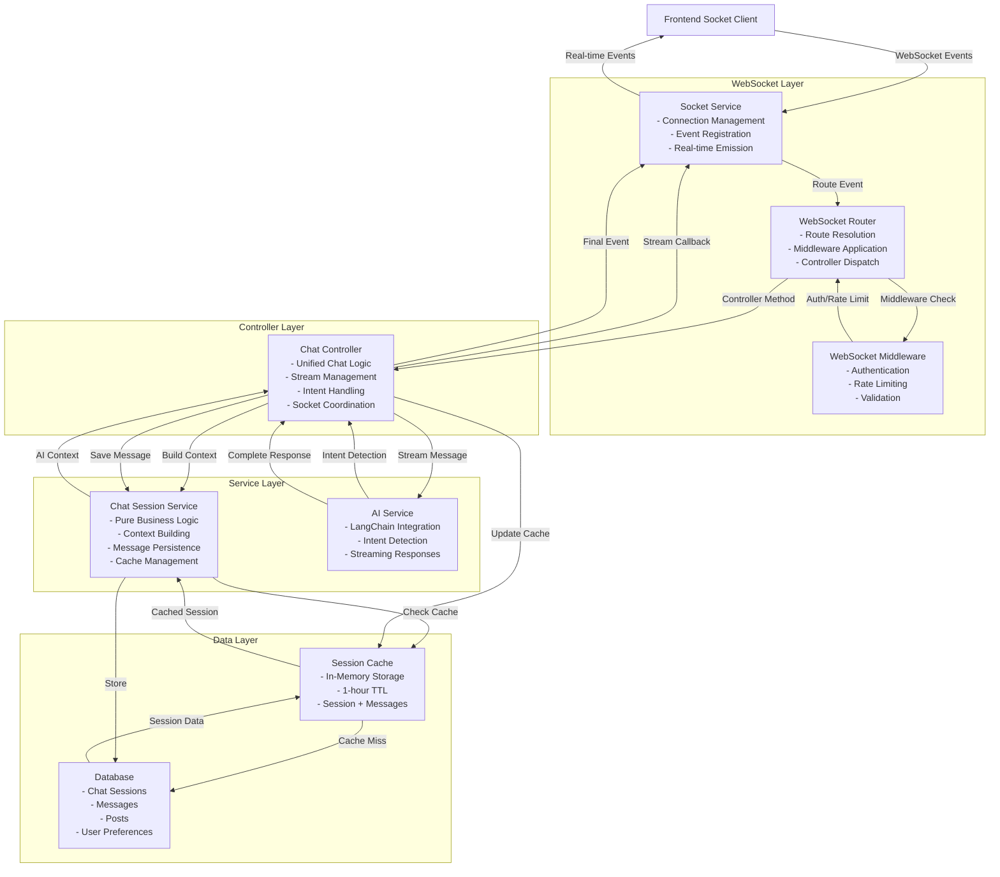
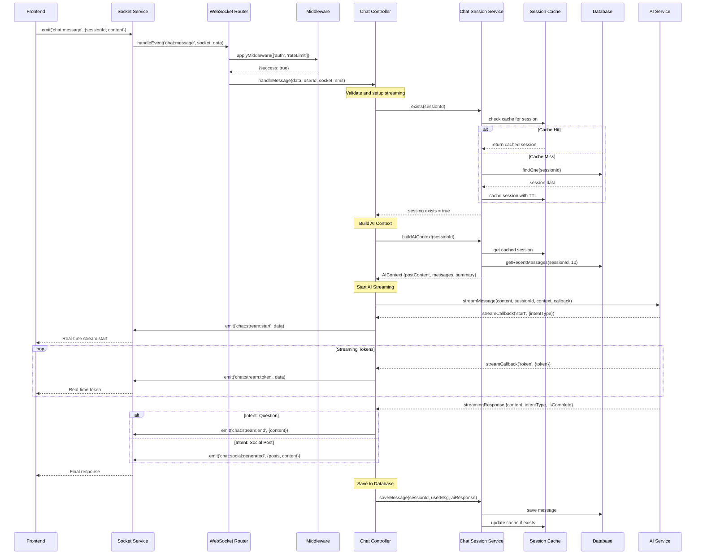
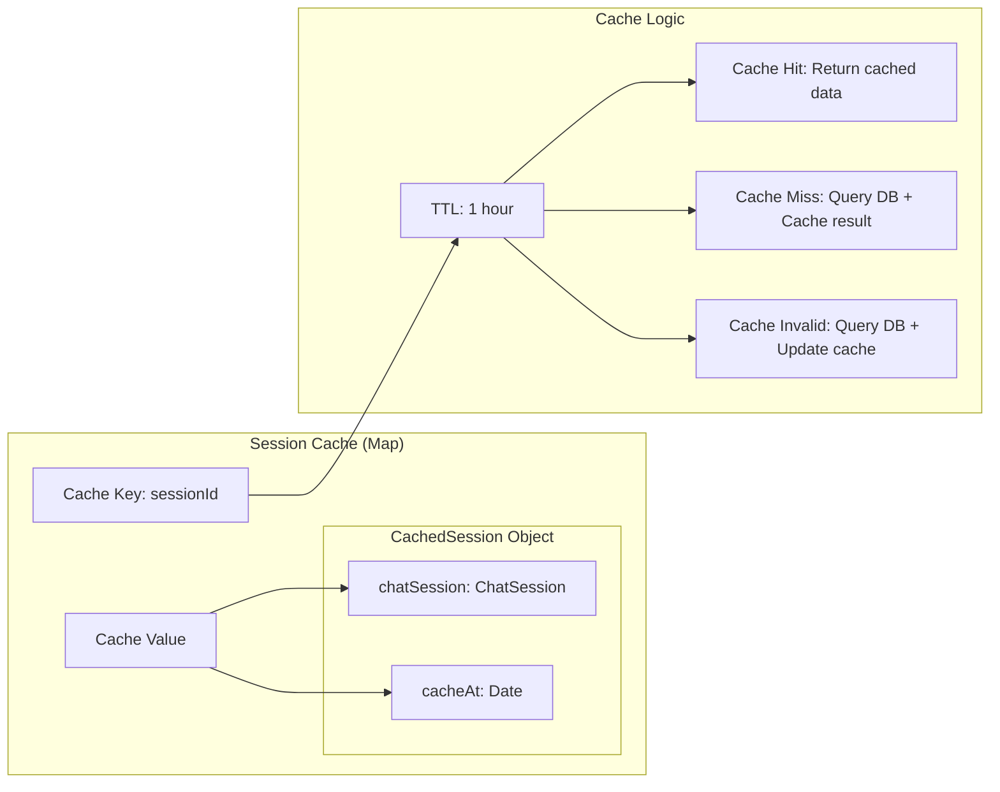
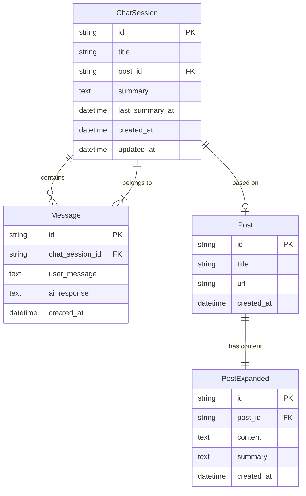
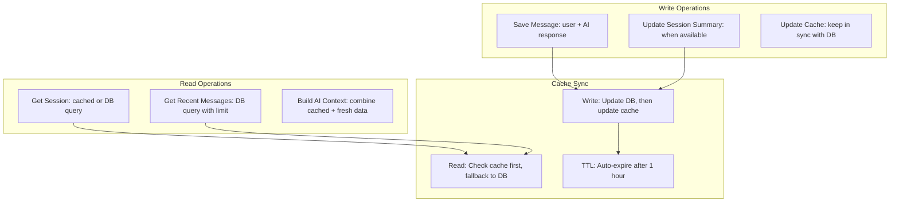
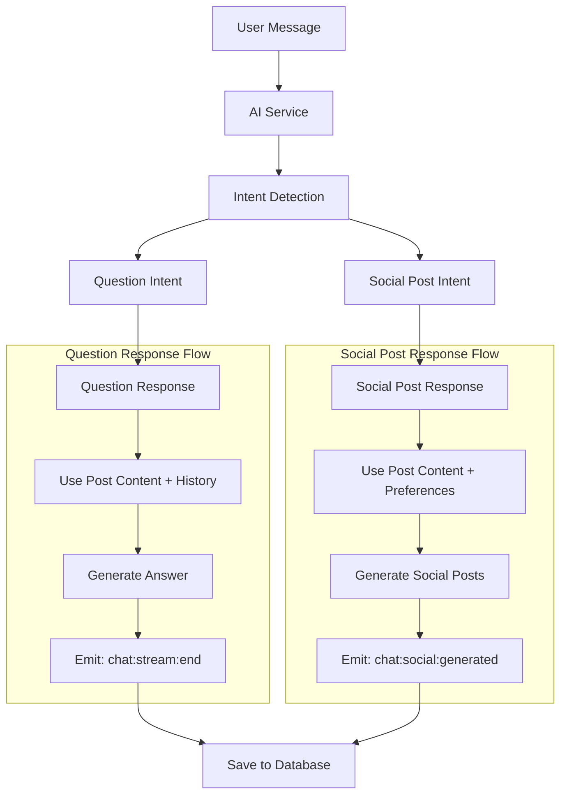
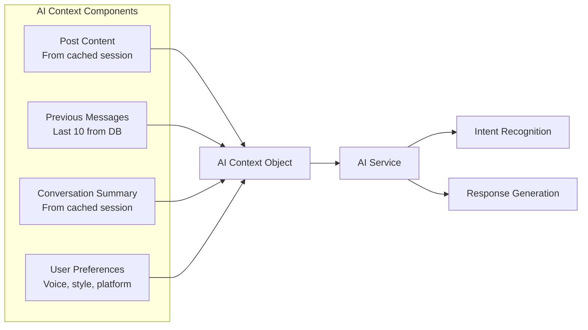
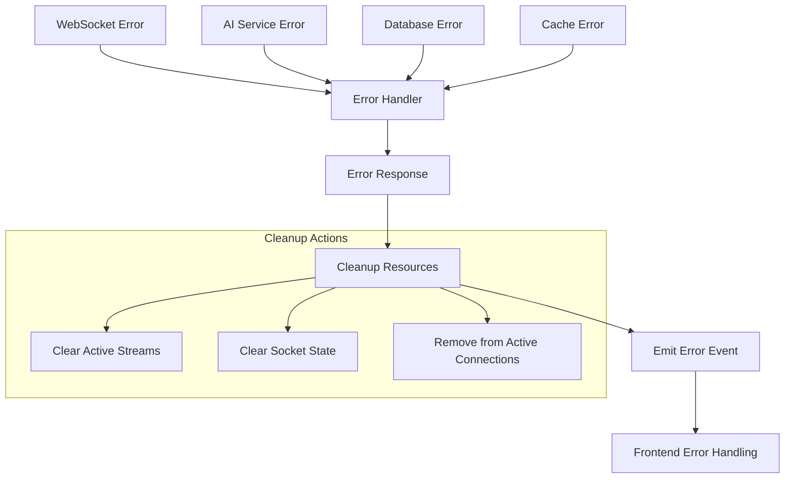

# WebSocket Architecture Flow Diagram

## Complete System Flow



## Detailed Message Flow

### 1. User Sends Message


## Cache Strategy

### Session Cache Details


### Cache Implementation
```typescript
// In ChatSessionService
private sessionCache = new Map<string, {
    chatSession: ChatSession,
    cacheAt: Date
}>();

private isCacheValid(cacheAt: Date): boolean {
    const CACHE_TTL_MS = 3600000; // 1 hour
    return (new Date().getTime() - cacheAt.getTime()) < CACHE_TTL_MS;
}

private async getCachedSession(sessionId: string): Promise<ChatSession | null> {
    const cached = this.sessionCache.get(sessionId);

    // Check TTL
    if (cached && this.isCacheValid(cached.cacheAt)) {
        return cached.chatSession; // Cache hit
    }

    // Cache miss or invalid - query database
    const session = await this.chatSessionRepository.findOne({
        where: { id: sessionId },
        relations: ['post', 'post.expanded']
    });

    if (session) {
        // Update cache
        this.sessionCache.set(sessionId, {
            chatSession: session,
            cacheAt: new Date()
        });
    }

    return session;
}
```

## Database Schema Integration

### Entity Relationships


### Database Operations Flow


## AI Intent Detection Flow

### Intent-Based Response Handling


### AI Context Building


## Performance Considerations

### Caching Benefits
1. **Reduced DB Queries**: Session data cached for 1 hour
2. **Faster Response Times**: Immediate access to frequently used sessions
3. **Memory Efficient**: Only active sessions cached
4. **Auto-Cleanup**: TTL prevents memory leaks

### Streaming Benefits
1. **Real-time UX**: Users see responses as they're generated
2. **Responsive Interface**: No waiting for complete response
3. **Interruptible**: Users can stop generation mid-stream
4. **Intent Awareness**: UI adapts based on detected intent

### Database Optimization
1. **Recent Messages**: Limited to last 10 for context
2. **Indexed Queries**: session_id, created_at indexed
3. **Efficient Relations**: Only load needed associations
4. **Batch Operations**: Single save operation per message

## Error Handling & Resilience

### Error Flow


This architecture provides a robust, scalable, and maintainable WebSocket system with efficient caching and clear separation of concerns!